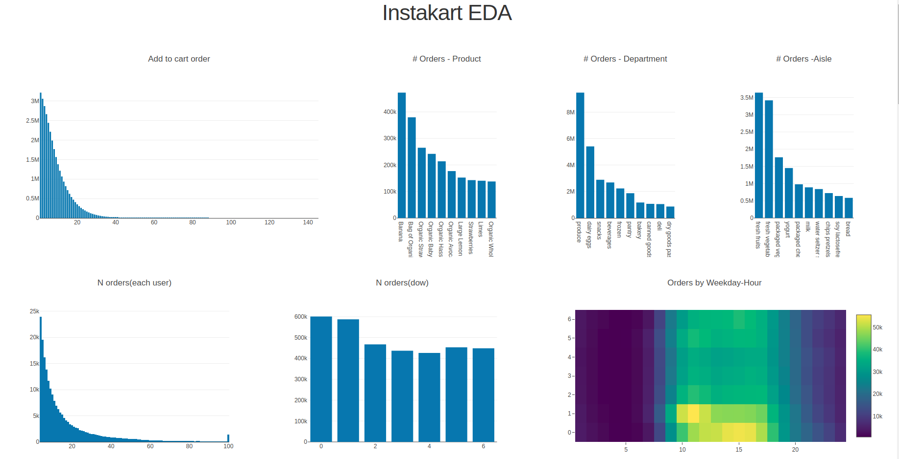
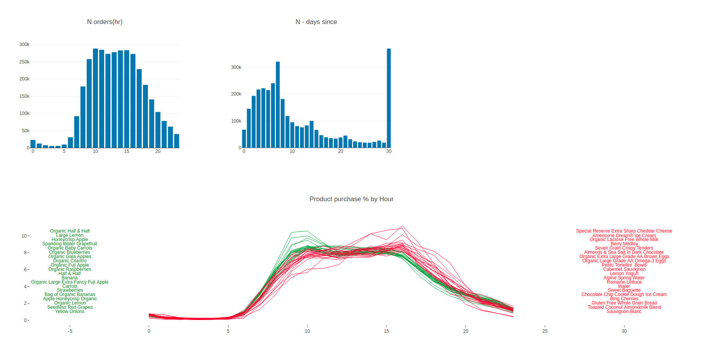
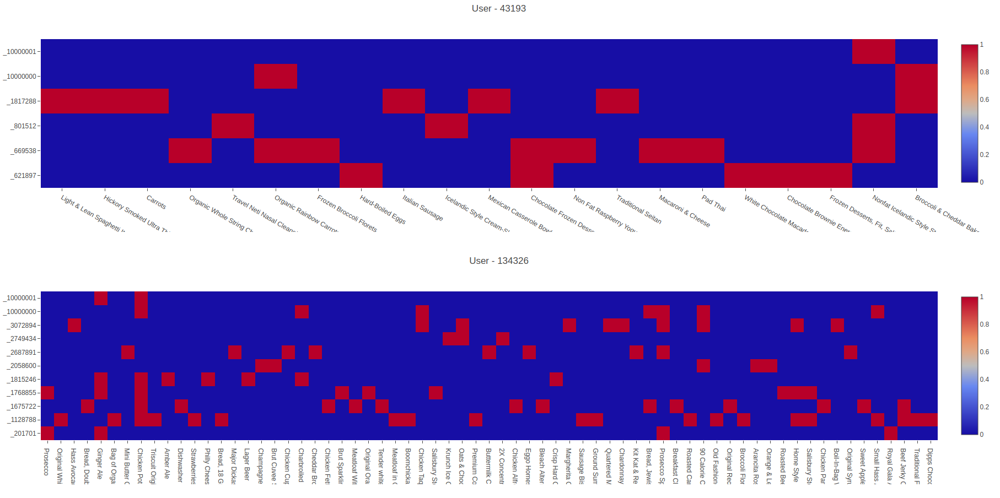
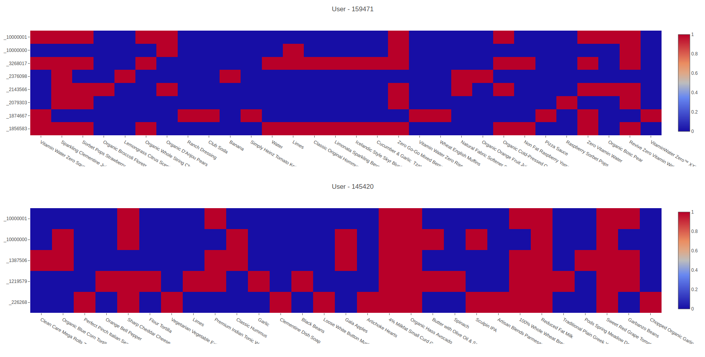
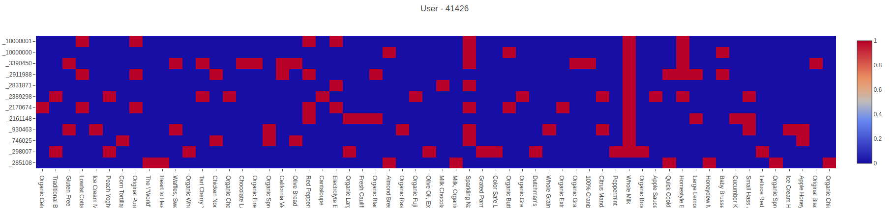

# Data Description

The dataset for this exercise is a relational set of files describing customer's orders over time. The goal of is to predict which products will be in a user's next order. 
The Instakart data on which we tested our models had between 4 and 100 orders for each user, with the sequence of products purchased in each order. They also provided the week and hour of day the order was placed, and a relative measure of time between orders. For more information, see the blog post accompanying its public release.

 > `orders`:
 > * `order_id`: order identifier
 > * `user_id`: customer identifier
 > * `eval_set`: which evaluation set this order belongs in (see `SET` described below)
 > * `order_number`: the order sequence number for this user (1 = first, n = nth)
 > * `order_dow`: the day of the week the order was placed on
 > * `order_hour_of_day`: the hour of the day the order was placed on
 > * `days_since_prior`: days since the last order, capped at 30 (with NAs for `order_number` = 1)
 >
 > `products`:
 > * `product_id`: product identifier
 > * `product_name`: name of the product
 > * `parent_category1_id`: foreign key
 > * `parent_category2_id`: foreign key
 >
 > `parent_category1`:
 > * `parent_category1_id`: parent category 1 identifier
 > * `parent_category1_desc`: the name of the parent category
 >
 > `parent_category2`:
 > * `parent_category2_id`: parent category 2 identifier
 > * `parent_category2_desc`: the name of the category
 >
 > `order_products__SET`:
 > * `order_id`: foreign key
 > * `product_id`: foreign key
 > * `add_to_cart_order`: order in which each product was added to cart
 > * `reordered`: 1 if this product has been ordered by this user in the past, 0 otherwise
 >
 > where `SET` is one of the four following evaluation sets (`eval_set` in `orders`):
 > * `"prior"`: orders prior to that users most recent order (~3.2m orders)
 > * `"train"`: training data supplied to participants (~131k orders)
 > * `"test"`: test data reserved for machine learning competitions (~75k orders)

The task is to predict which products a user will reorder in their next order. The evaluation metric is the F1-score between the set of predicted products and the set of true products.

# EDA
Models basked on Instakart market basket data to predict next basket for users

Sample Users(Order history); 10000000: Last order, 10000001: Prediction

